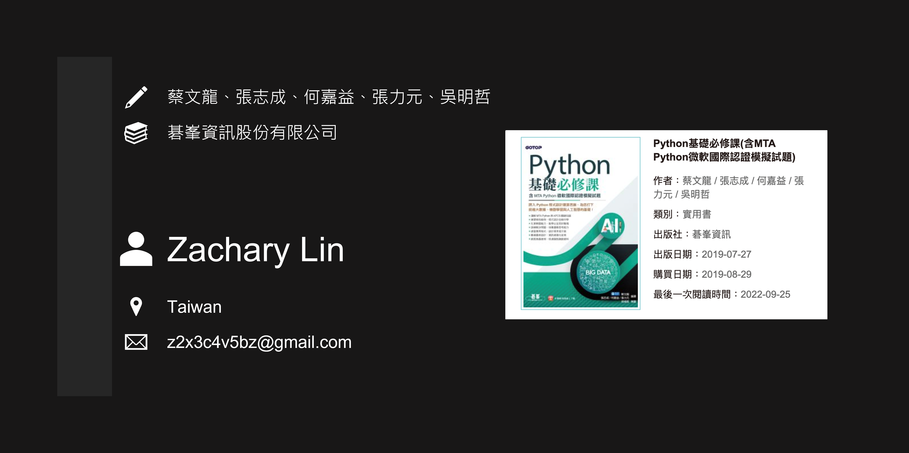

# Python 基礎必修課（習題個人解答） #

## Abstract ##

**Title:** Python 基礎必修課

**Auther:** 蔡文龍、張志成、何嘉益、張力元

**Introduction:**

>- 講解 MTA Python 與 APCS 關鍵知識
>- 練習修改範例，程式設計由做中學
>- 扎實解題能力，能學以致用於職場
>- 訓練解決問題，培養邏輯思考能力
>- 視窗應用程式，設計使用者介面
>- 數據圖表設計，資訊視覺化呈現
>- 網頁爬蟲實例，快速擷取網路資料

※ 習題開發環境為 Python 3.x，作業系統使用 Microsoft Windows 7/10 x64，並選擇軟體 VS Code 為文字編輯器。

※ 原諒我題目內不附圖示。

※ 請留意，文中數學公式在瀏覽器頁面中可能無法正確顯示。

※ 圖書封面、圖書資訊、章節內容、習題皆為版權作者、出版商所有，本站所刊內容僅供教育、學習使用。

## Table of Contents ##

- [Python 基礎必修課（習題個人解答）](#python-基礎必修課習題個人解答)
  - [Abstract](#abstract)
  - [Table of Contents](#table-of-contents)
  - [Chapter 01 -- Python 語言概觀](#chapter-01----python-語言概觀)
  - [Chapter 02 -- 基本程式設計](#chapter-02----基本程式設計)
  - [Chapter 03 -- 選擇結構](#chapter-03----選擇結構)
  - [Chapter 04 -- 重複結構](#chapter-04----重複結構)
  - [Chapter 05 -- 串列](#chapter-05----串列)
  - [Chapter 06 -- 函式](#chapter-06----函式)
  - [Chapter 07 -- 遞迴](#chapter-07----遞迴)
  - [Chapter 08 -- 字串](#chapter-08----字串)
  - [Chapter 09 -- 元組、字典、集合](#chapter-09----元組字典集合)
  - [Chapter 10 -- 檔案與例外處理](#chapter-10----檔案與例外處理)
  - [Chapter 11 -- 繪製圖表](#chapter-11----繪製圖表)
  - [Chapter 12 -- 視窗應用程式](#chapter-12----視窗應用程式)
  - [Chapter 13 -- 網頁資料擷取分析](#chapter-13----網頁資料擷取分析)

## Chapter 01 -- Python 語言概觀 ##

>- 電腦系統簡介
>- 電腦系統的基本架構
>- 電腦硬體
>- 電腦軟體
>- 程式語言的分類
>- 翻譯器的分類
>- Python 語言的沿革和特色
>- 程式設計的五大階段
>- 編輯器與翻譯器
>- 流程圖和虛擬碼
>- 建置 Anaconda 開發環境
>- Spyder 整合開發環境介紹
>- Python 語言格式簡介
>- 編寫第一個 Python 程式

### [Question 01-03](ch01/hw01_03/hw01_03.py) ###

### [Question 01-04](ch01/hw01_04/hw01_04.py) ###

### [Question 01-05](ch01/hw01_05/hw01_05.py) ###

### [Question 01-06](ch01/hw01_06/hw01_06.py) ###

### [Question 01-07](ch01/hw01_07/hw01_07.py) ###

## Chapter 02 -- 基本程式設計 ##

>- 物件簡介
>- 內建基本資料型別
>- 整數、布林常值
>- 浮點數、字串常值
>- 識別字與保留字
>- 變數宣告
>- 整數、布林資料型別
>- `float`、`decimal` 浮點數資料型別
>- 指定、算數、複合指定運算子
>- 關係、邏輯運算子
>- 位元、位移運算子
>- `in` 與 `is` 運算子
>- 運算子的優先順序
>- 自動型別轉換
>- 強制型別轉換
>- `print()` 輸出函式
>- `input()` 輸入函式

### [Question 02-01](ch02/hw02_01/hw02_01.py) ###

### [Question 02-02](ch02/hw02_02/hw02_02.py) ###

### [Question 02-03](ch02/hw02_03/hw02_03.py) ###

### [Question 02-04](ch02/hw02_04/hw02_04.py) ###

### [Question 02-05](ch02/hw02_05/hw02_05.py) ###

### [Question 02-06](ch02/hw02_06/hw02_06.py) ###

### [Question 02-07](ch02/hw02_07/hw02_07.py) ###

## Chapter 03 -- 選擇結構 ##

>- 結構化程式設計
>- 關係運算式
>- 邏輯運算式
>- 選擇結構

### [Question 03-01](ch03/hw03_01/hw03_01.py) ###

### [Question 03-02](ch03/hw03_02/hw03_02.py) ###

### [Question 03-03](ch03/hw03_03/hw03_03.py) ###

### [Question 03-04](ch03/hw03_04/hw03_04.py) ###

## Chapter 04 -- 重複結構 ##

>- 何謂迴圈
>- `for` 迴圈
>- `while` 迴圈
>- `continue` 與 `break`
>- 巢狀迴圈
>- 無窮迴圈

### [Question 04-01](ch04/hw04_01/hw04_01.py) ###

### [Question 04-02](ch04/hw04_02/hw04_02.py) ###

### [Question 04-04](ch04/hw04_04/hw04_04.py) ###

### [Question 04-05](ch04/hw04_05/hw04_05.py) ###

## Chapter 05 -- 串列 ##

>- 何謂串列
>- 一維串列
>- 使用迴圈操作串列
>- 串列常用的函式與方法
>- 串列的排序
>- 二維串列

### [Question 05-01](ch05/hw05_01/hw05_01.py) ###

### [Question 05-02](ch05/hw05_02/hw05_02.py) ###

### [Question 05-03](ch05/hw05_03/hw05_03.py) ###

### [Question 05-04](ch05/hw05_04/hw05_04.py) ###

### [Question 05-05](ch05/hw05_05/hw05_05.py) ###

### [Question 05-06](ch05/hw05_06/hw05_06.py) ###

## Chapter 06 -- 函式 ##

>- 何謂函式
>- 內建函式
>- 自訂函式
>- 引數的傳遞方式
>- 引數傳遞使用串列
>- 全域變數與區域變數

### [Question 06-01](ch06/hw06_01/hw06_01.py) ###

### [Question 06-02](ch06/hw06_02/hw06_02.py) ###

### [Question 06-03](ch06/hw06_03/hw06_03.py) ###

### [Question 06-04](ch06/hw06_04/hw06_04.py) ###

## Chapter 07 -- 遞迴 ##

>- 遞迴
>- 數列
>- 階乘
>- 最大公因數
>- 費氏數列
>- 巴斯卡定理
>- 堆疊
>- 多遞迴

### [Question 07-01](ch07/hw07_01/hw07_01.py) ###

### [Question 07-02](ch07/hw07_02/hw07_02.py) ###

### [Question 07-03](ch07/hw07_03/hw07_03.py) ###

### [Question 07-04](ch07/hw07_04/hw_07_04.py) ###

## Chapter 08 -- 字串 ##

>- 字串資料型別
>- 字串與運算子
>- 逸岀序列
>- 格式化輸出
>- 常用的字串方法

### [Question 08-01](ch08/hw08_01/hw08_01.py) ###

### [Question 08-02](ch08/hw08_02/hw08_02.py) ###

### [Question 08-03](ch08/hw08_03/hw08_03.py) ###

### [Question 08-04](ch08/hw08_04/hw08_04.py) ###

## Chapter 09 -- 元組、字典、集合 ##

>- 元組
>- 字典
>- 集合

### [Question 09-01](ch09/hw09_01/hw09_01.py) ###

### [Question 09-02](ch09/hw09_02/hw09_02.py) ###

### [Question 09-03](ch09/hw09_03/hw09_03.py) ###

## Chapter 10 -- 檔案與例外處理 ##

>- 檔案概論
>- 資料夾的建立與刪除
>- 檔案的開啟與關閉
>- 文字檔資料的寫入與讀取
>- 例外處理

### [Question 10-01](ch10/hw10_01/hw10_01.py) ###

### [Question 10-02](ch10/hw10_02/hw10_02.py) ###

### [Question 10-03](ch10/hw10_03/hw10_03.py) ###

## Chapter 11 -- 繪製圖表 ##

>- matplotlib 套件簡介
>- 繪製線條圖
>- 繪製柱狀圖
>- 繪製圓餅圖

### [Question 11-01](ch11/hw11_01/hw11_01.py) ###

### [Question 11-02](ch11/hw11_02/hw11_02.py) ###

## Chapter 12 -- 視窗應用程式 ##

>- tkinter 套件簡介與匯入
>- Label 標籤元件
>- 視窗版面配置
>- Button 按鈕元件
>- Entry 文字方塊元件
>- messagebox 對話方塊元件
>- Radiobutton 選項按鈕元件
>- Checkbutton 核取按鈕元件
>- Photoimage 圖片元件

### [Question 12-01](ch12/hw12_01/hw12_01.py) ###

### [Question 12-02](ch12/hw12_02/hw12_02.py) ###

## Chapter 13 -- 網頁資料擷取分析 ##

>- 網路爬蟲
>- urllib 套件解析網址與擷取網頁
>- requests 套件擷取網頁
>- BeautifulSoup 套件解析網頁
>- 網頁爬蟲實例 - 碁峰資訊新書快報

### [Question 13-01](ch13/hw13_01/hw13_01.py) ###

